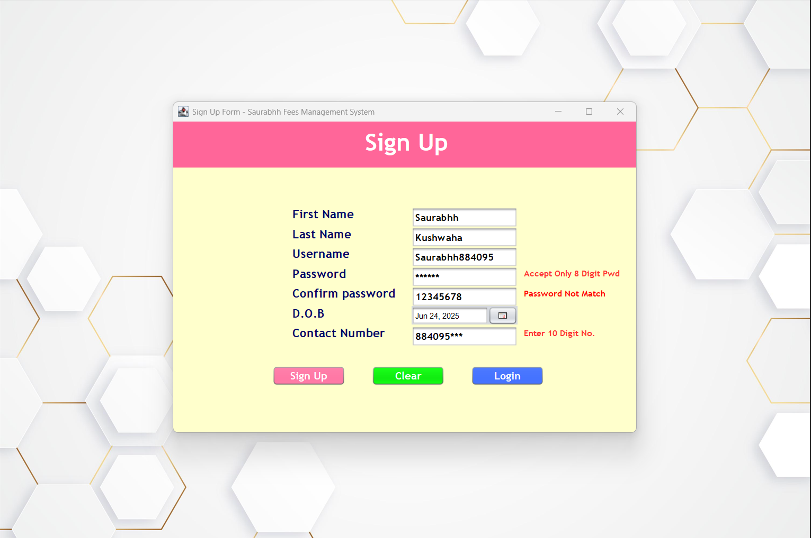
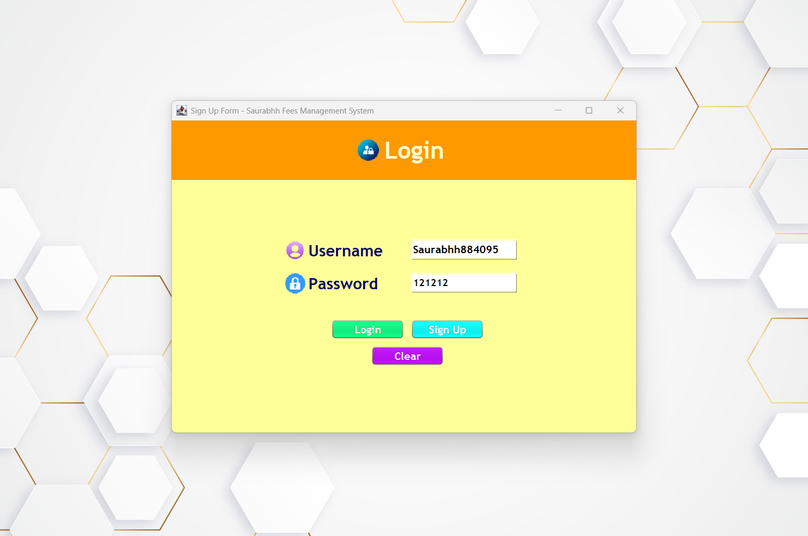

# Fees Management System

A Java-based Fees Management System developed using **Swing GUI** and **Apache NetBeans IDE**. This open-source project helps institutions like coaching centers or colleges manage student fee records efficiently.

---

## 📌 Project Description

This desktop application allows admin users to:

- Add new students  
- Record and update fee payments  
- Generate fee receipts  
- View payment history  
- Track pending dues  

Designed with **Object-Oriented Programming** principles and built using **Java Swing** for the graphical user interface.

---

## 🧰 Tech Stack

- **IDE**: Apache NetBeans  
- **Language**: Java  
- **GUI**: Java Swing  
- **Database**: MySQL (optional), or Java File I/O  
- **License**: MIT License (Open Source)

---

## 🎯 Features

- Student registration with details  
- Fee payment entry and update  
- Auto-generated receipts (Swing-based view)  
- Due tracking and alert  
- Search students by ID or Name  
- Admin dashboard UI

---

## 🗂️ Folder Structure

```
Fees-Management-System/
│
├── screenshots/
│   ├── SignUpPage.png 
│   ├── LoginPage.png
│
├── src/
│   └── main/
│       ├── java/
│       │   └── com/
│       │       └── wearl/
│       │           └── feesmanagementsystem/
│       │               ├── Addfees.java
│       │               ├── Dashboard.java
│       │               ├── FeesManagementSystem.java
│       │               ├── Homepage.java
│       │               ├── LoginPage.java
│       │               └── SignUpPage.java
│       │
│       └── resources/
│           └── images/
│               ├── JDBC Connectivity.png
│               ├── Login.png
│               ├── password.png
│               └── user.png
│
├── LICENSE
├── README.md
└── pom.xml
```

---

## 📷 GUI Preview

### 📝 SignUp Page  


### 📝 Login Page 


*(You can add more screenshots in the `screenshots/` folder and reference them here.)*

---

## 🚀 How to Run

1. Open Apache NetBeans.  
2. Go to `File > Open Project` and select the project folder.  
3. Configure MySQL DB in `DatabaseConnection.java` (optional).  
4. Right-click on `Main.java` > Run.

---

## 📄 License

This project is licensed under the MIT License.  
© 2025 Saurabh Kushwaha

See the [LICENSE](./LICENSE) file for detailed usage terms.

---

## 📬 Contact

For suggestions, queries, or collaborations:  
📧 saurabh@wearl.co.in  
🔗 LinkedIn: [Saurabhh](https://www.linkedin.com/in/saurabh884095/)  
🔗 GitHub: [github.com/Github-Saurabh0](https://github.com/Github-Saurabh0)  
📷 Instagram: [@dev.wearl](https://instagram.com/dev.wearl)

---

## 🤝 Contribution

Pull requests are welcome! Please fork the repo, make changes, and raise a PR.